# Architecture Diagrams — Distributed Task Processing Platform

This document contains visual architecture diagrams.

These diagrams complement `system-design.md`.

---

# 1. High-Level System Architecture

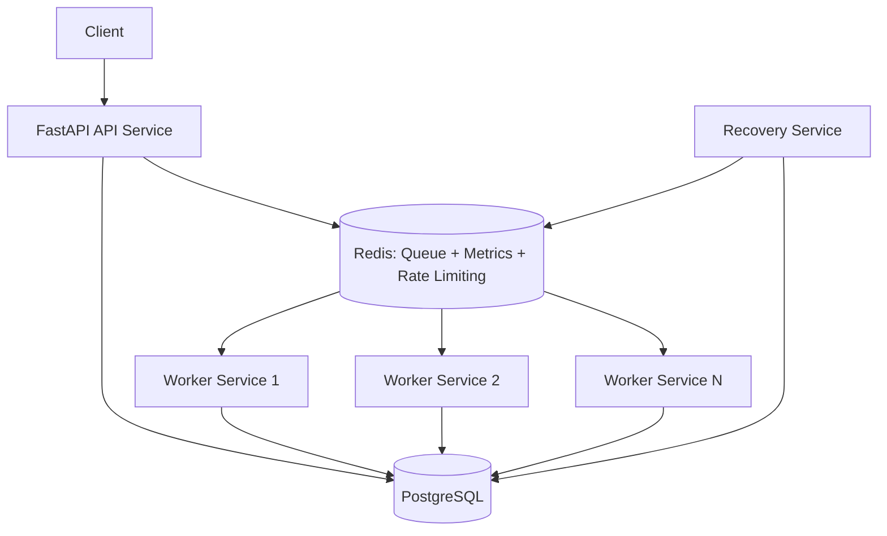

Description:

* API handles requests and enforces rate limiting
* PostgreSQL stores task state and ownership
* Redis acts as queue + metrics store + rate limiter backend
* Workers process tasks with lease + heartbeat
* Recovery service ensures fault tolerance

---

# 2. Task Creation Flow (With Rate Limiting)

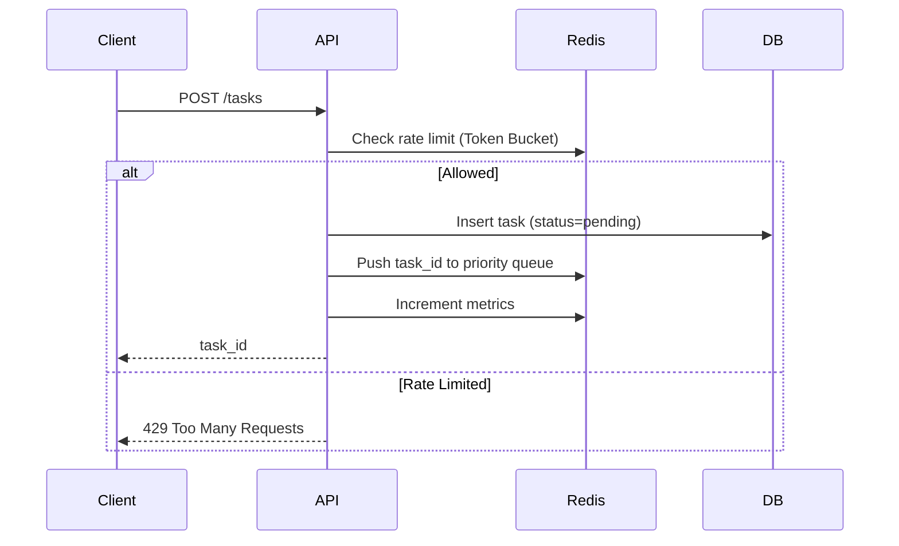

---

# 3. Worker Execution Flow (Lease + Heartbeat)

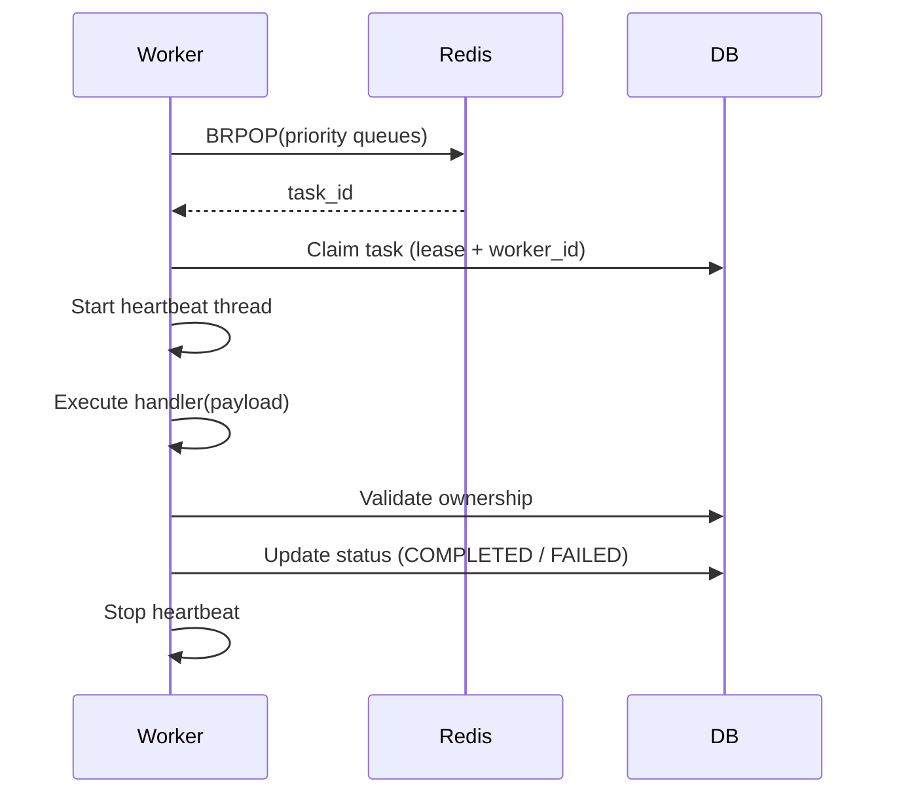

Key Concepts:

* Lease-based ownership
* Heartbeat for liveness
* Ownership validation prevents stale updates

---

# 4. Lease & Heartbeat Mechanism

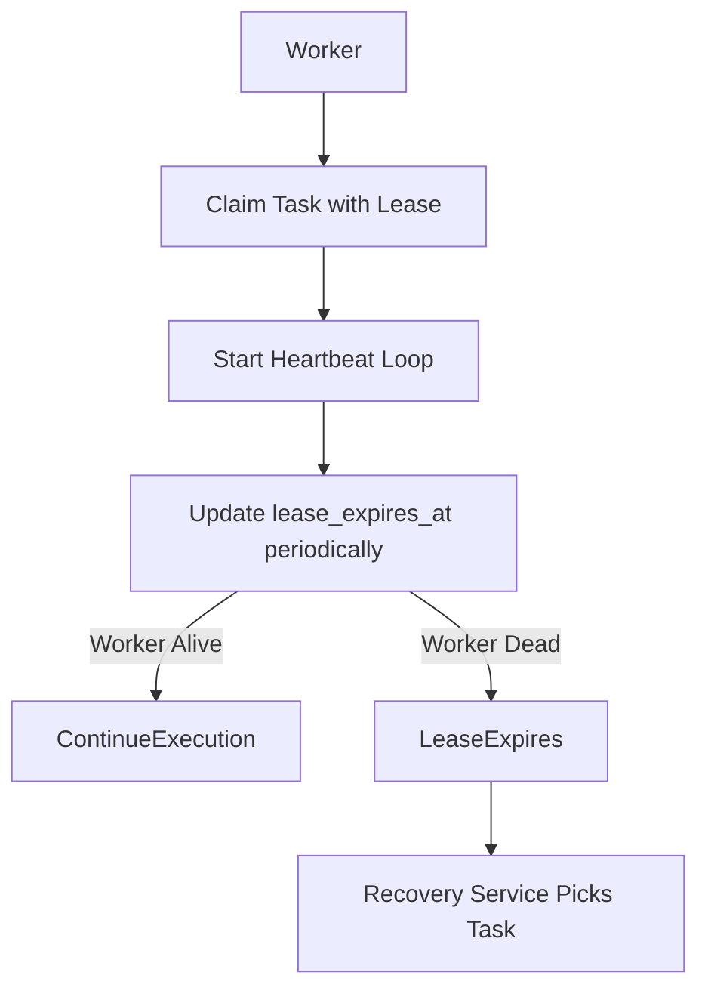

---

# 5. Worker Failure & Recovery

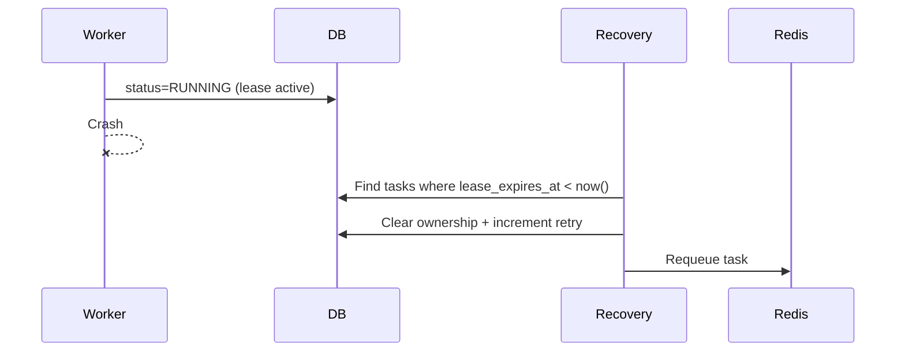

This ensures:

* no stuck tasks
* safe retry mechanism
* fault tolerance

---

# 6. Queue Architecture (Priority-Based)

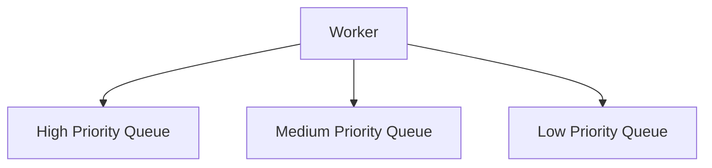

Worker fetch logic:

1. High priority
2. Medium priority
3. Low priority

---

# 7. Task Lifecycle

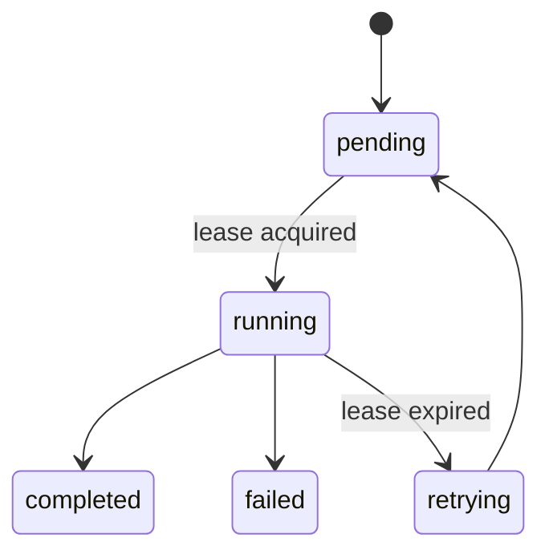

---

# 8. Observability Architecture

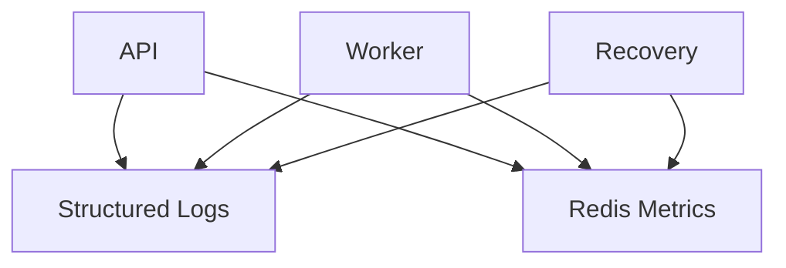

Description:

* Logs are structured (JSON) and emitted to stdout
* Metrics are stored in Redis
* Provides system visibility and debugging

---

# 9. Rate Limiting Architecture

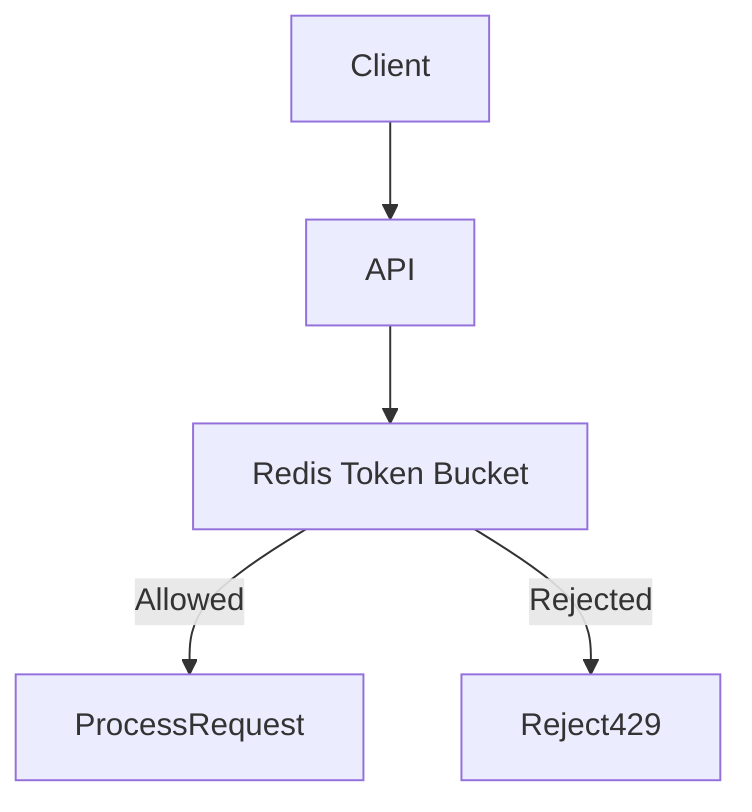

Features:

* Token bucket algorithm
* Distributed-safe (Lua script)
* Burst handling

---

# 10. Service Deployment Layout

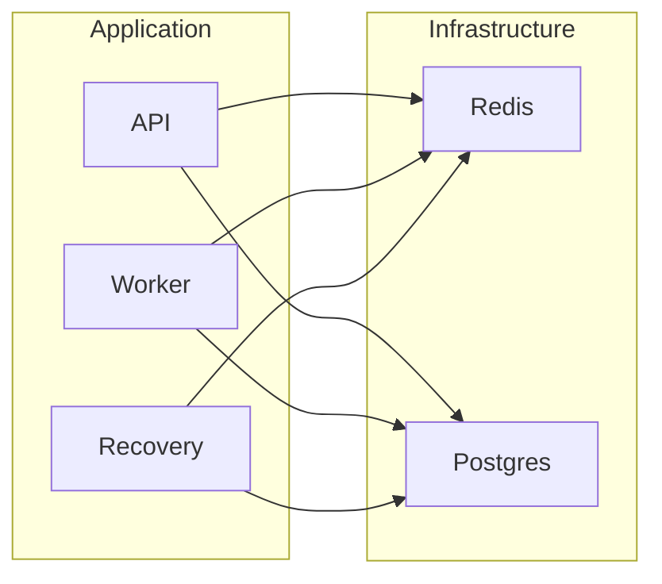

---

# 11. Worker Internal Flow

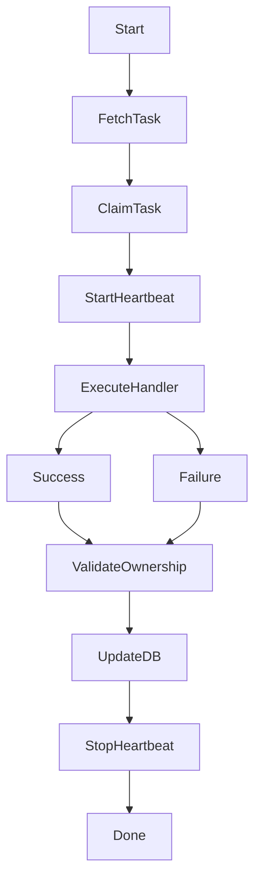

---

# 12. Scaling Model

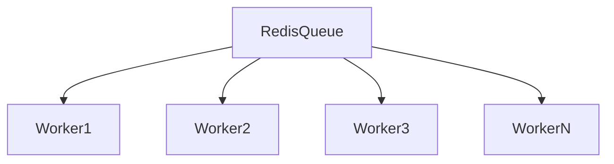

Scaling example:

```
docker-compose up --scale worker=10
```

---

# 13. Design Principles

* asynchronous processing
* distributed workers
* lease-based ownership model
* fault tolerance via recovery service
* stateless worker design
* observability (logs + metrics)
* API protection (rate limiting)

---
