\# Architecture Diagrams — Distributed Task Processing Platform


This document contains visual architecture diagrams used for understanding and implementing the system.


These diagrams complement `system-design.md`.


---


\# 1. High-Level System Architecture


This shows the major services and their interactions.


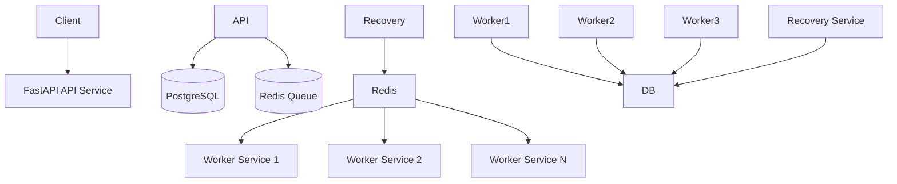


Description:


\* Client sends requests to API

\* API stores tasks in PostgreSQL

\* API pushes task IDs to Redis

\* Workers consume tasks from Redis

\* Workers update results in PostgreSQL

\* Recovery service monitors stuck tasks


---


\# 2. Task Creation Flow


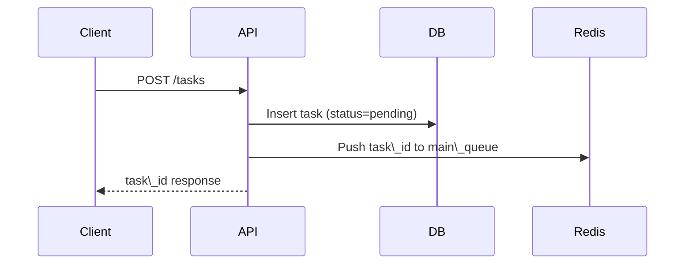


Key idea:


API defines the \*\*system contract\*\*.


---


\# 3. Worker Execution Flow


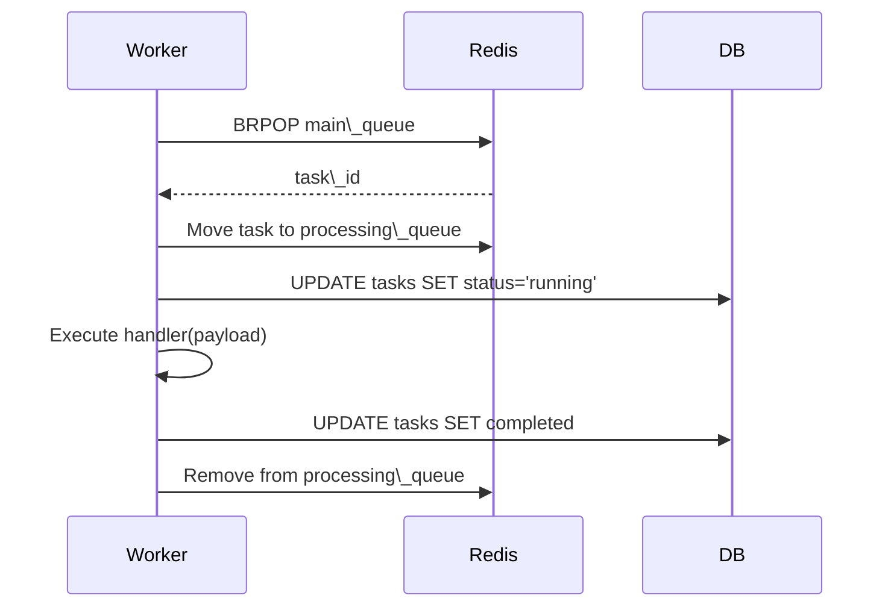


Important concepts:


\* blocking queue

\* task claiming

\* execution tracking


---


\# 4. Worker Failure Scenario


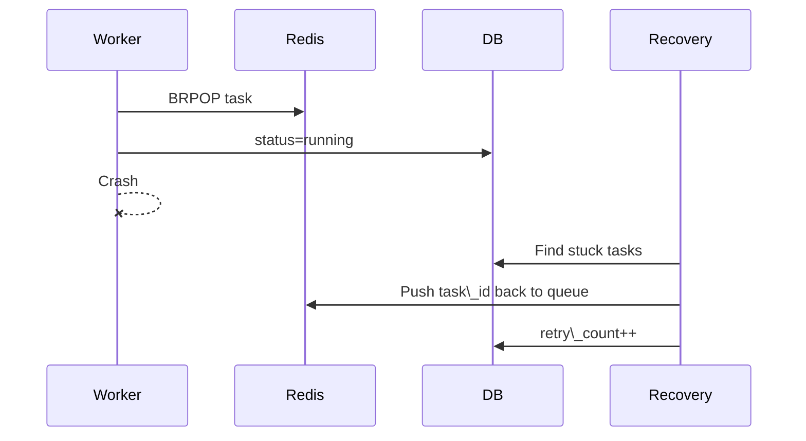


This prevents \*\*lost tasks\*\*.


---


\# 5. Queue Architecture


Workers consume tasks using \*\*priority queues\*\*.


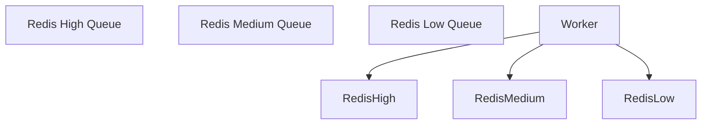


Worker priority order:


1\. High queue

2\. Medium queue

3\. Low queue


---


\# 6. Task Lifecycle


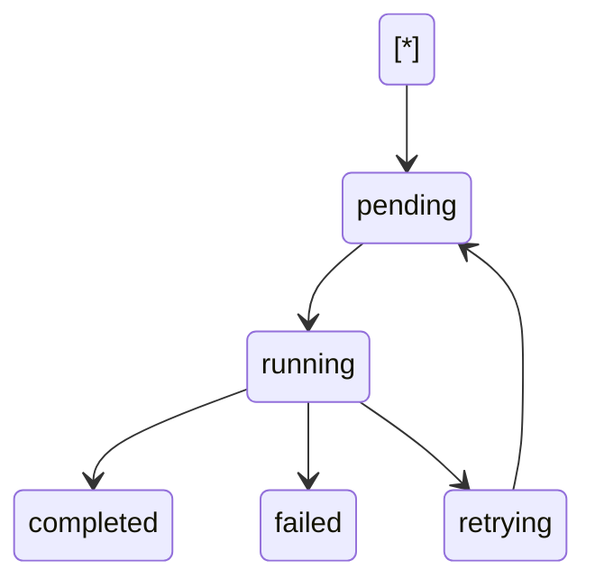


---


\# 7. Service Deployment Layout


Services run independently but share infrastructure.


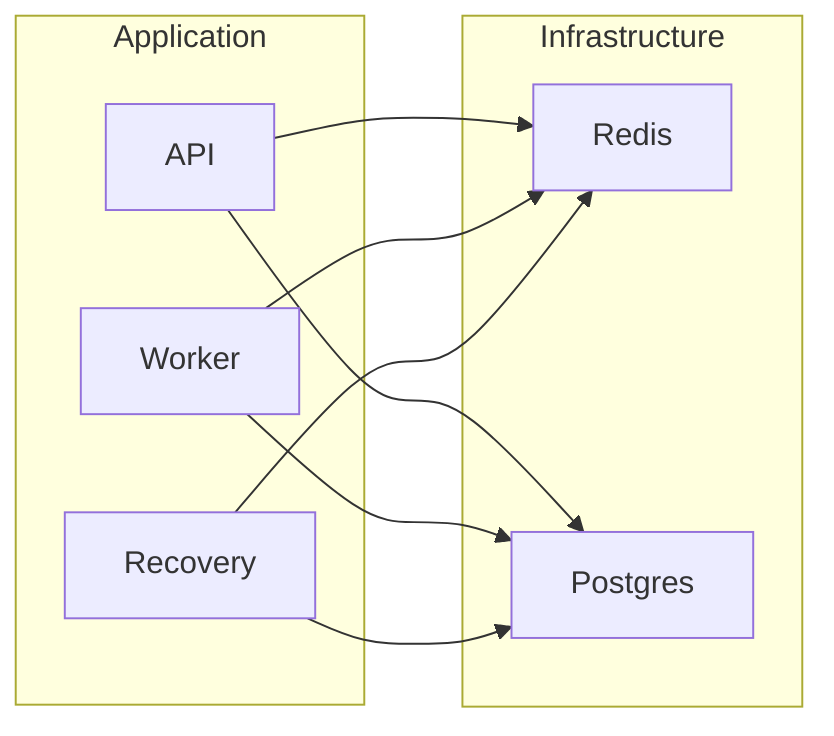


---


\# 8. Worker Internal Flow


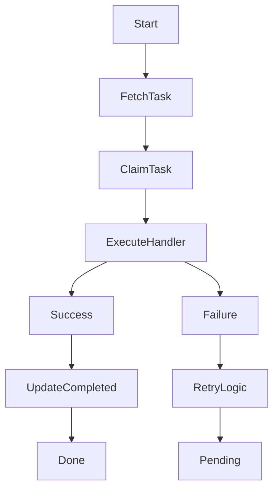


---


\# 9. Repository Structure


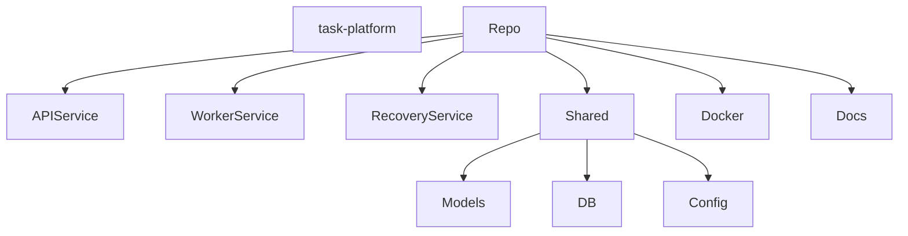


---


\# 10. Scaling Model


Workers scale horizontally.


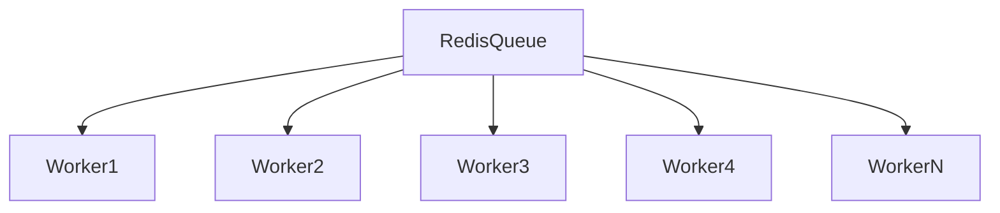


Scaling example:


```

docker-compose up --scale worker=10

```


---


\# 11. Future Architecture Evolution


Possible future architecture:


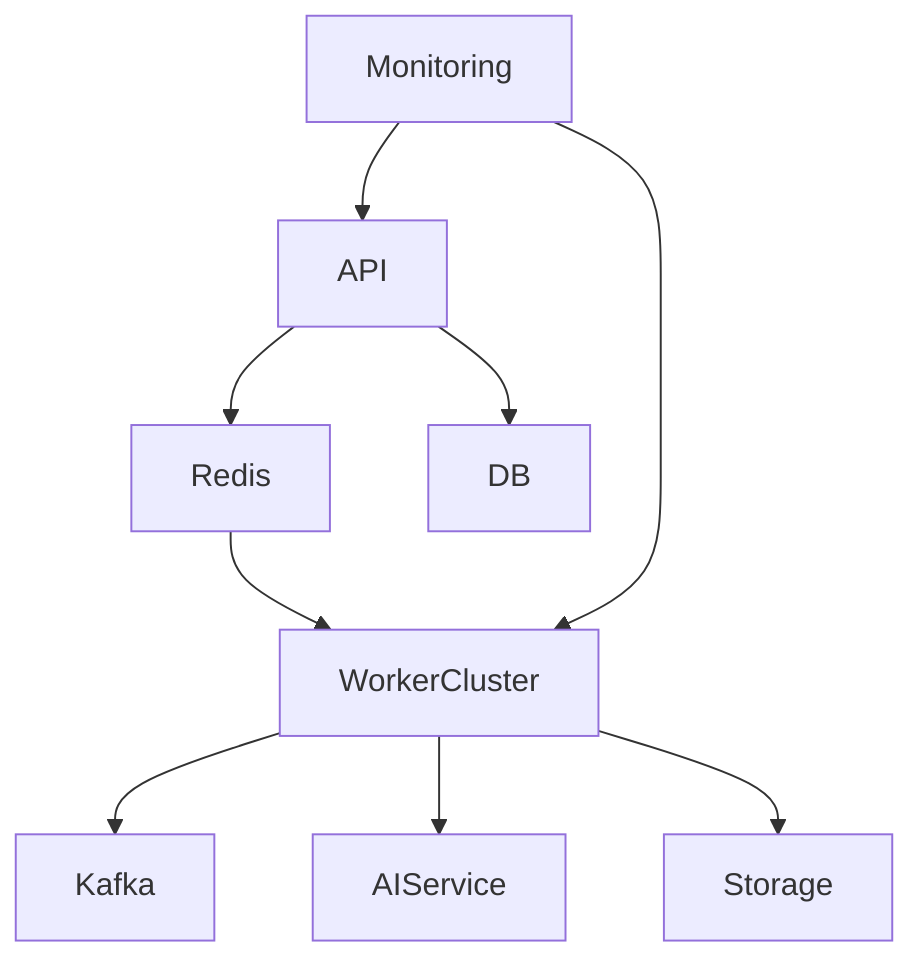


Future additions:


\* event streaming

\* AI inference

\* metrics dashboards

\* distributed scaling


---


\# 12. Design Principles Used


Key architecture principles used in this system:


\* asynchronous processing

\* queue-based workload distribution

\* worker horizontal scaling

\* failure recovery mechanisms

\* service isolation

\* stateless worker design


These principles mirror many real distributed systems.


